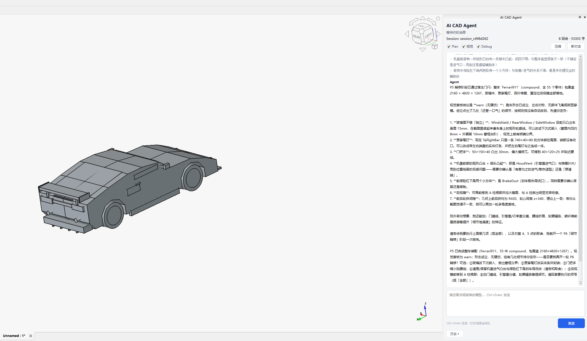
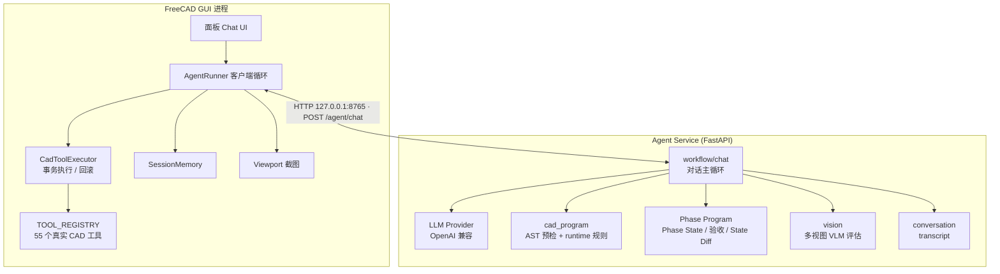

# NL-FreeCAD-Agent

**用自然语言驱动 FreeCAD 建模的 Agent。** 你描述一个零件或整机，Agent 自己规划建模路径、
写受限的 `cad.*` 程序，在 FreeCAD 里真实执行，并由宿主按几何事实决定这一步算不算通过。

> Windows · Python 3.12 · FreeCAD 0.21+ · FastAPI + OpenAI 兼容 LLM
> 主路径：**Phase Program Code Mode** —— Agent 规划，宿主治理。

---

## 效果

一句话需求 → Agent 自主规划阶段 → 生成受限 `cad.*` 程序 → 在 FreeCAD 里真实执行 → 宿主按几何事实验收。

下面这张是 **AI CAD Agent 面板**，左侧是对话与阶段计划（`plan` / `tools` / `vision` 逐轮推进），
右侧是 FreeCAD 视口里正在生成的模型：



跑完一条需求后，模型会留下**完整命名的特征树**。例如"创建一个人形的高达模型"这条，
Agent 自己规划出 5 个语义阶段，产出 34 个命名零件：

```text
Pelvis  Torso  Head
Foot_R/Shin_R/Knee_R/Thigh_R/Leg_R      Foot_L/Shin_L/Knee_L/Thigh_L/Leg_L
Shoulder_R/UpperArm_R/Elbow_R/Forearm_R/Hand_R/Arm_R
Shoulder_L/UpperArm_L/Elbow_L/Forearm_L/Hand_L/Arm_L
ShoulderArmor_R  ShoulderArmor_L  ChestArmor
Backpack  Thruster_R  Thruster_L  VFin_R  VFin_L
Gundam                     ← cad.compound 装配的整机
```

> 中途它自己踩过坑：第 4 轮写出 `create_box(rot_y=...)`，而该工具没有这个参数。
> 宿主按阶段驳回后，模型在第 5 轮自行修正，第 7 轮才推进 —— 具体日志见下文"一次真实的自纠错"。

---

## 一句话原理

```text
用户描述意图
  → Agent 规划语义阶段（Soft Plan，可动态调整）
  → Agent 写当前阶段的受限 Python（cad.box / cad.polar_pattern / cad.compound …）
  → 宿主 AST 预检 + 预算
  → FreeCAD 单事务执行（失败即回滚）
  → Program Receipt：程序指纹 + 执行前后 State Diff
  → 宿主按几何事实做确定性验收（bbox / 中心 / 体积 / solid 数 / 对象数）
  → passed 才推进下一阶段；failed 只修当前阶段
```

**关键点：规划权在模型，推进权在宿主。** 模型不能自己宣布"做完了" —— 这一条由 [ADR-0001](docs/adr/0001-agent-plans-host-governs-phase-programs.md) 定死，
也因此修掉了早期"模型自称完成、实际几何不对"的问题。

---

## 系统架构



- **服务端**：推理、提示词、AST 预检、Phase State 与确定性验收、视觉评估、会话记录。**不碰 FreeCAD。**
- **插件端**：GUI、真实 CAD 执行（主线程单事务）、文档状态、截图、客户端记忆。**不做 LLM。**
- 三层工具：`cad.*`（薄 API，模型可见）→ `cad_program` 映射 → `TOOL_REGISTRY`（55 个实现）。
  完整工具 schema **不进模型上下文**，只在契约对齐与测试中使用。

---

## 核心设计

| 设计 | 说明 |
|------|------|
| **Code Mode** | 模型写受限 Python（`cad.*`），不是自由 FreeCAD 脚本，也不是逐个挑选 tool schema。AST 沙箱在服务端预检。 |
| **规划 / 治理分离** | `soft_plan` 只是建议；阶段推进由宿主按文档事实裁决。宿主冻结验收条件，模型只能追加、不能放宽。 |
| **单事务执行** | 每个阶段一个事务，失败回滚，不留半成品。程序身份 = `phase_id + 归一化程序 hash + execution_key`，可幂等重放。 |
| **几何 Oracle** | L3/L4 用真实 FreeCAD 校验工具的 bbox / 中心 / 轴向 / 体积 —— 它抓到过 `Shape.BoundBox` 对曲面报错的真 bug。 |
| **人机在环** | 可对话澄清、随时停手改指示；视觉 `warn` 默认问用户而非空转修码。 |

工具分层、装配策略（为什么整机用 `cad.compound` 而不是 `fuse`）等细节见
[docs/code_mode.md](docs/code_mode.md) 与 [docs/cad_modeling_recipes.md](docs/cad_modeling_recipes.md)。

---

## 效果是怎么量出来的

项目对"效果"分五层验证，**每一层都有可跑的判据**：

| 层级 | 验什么 | 当前结果 |
|------|--------|---------|
| L0–L1 | 单元 / 契约测试（无 FreeCAD） | **246 passed** |
| L2 | 全工具冒烟（FreeCADCmd） | 114 / 0 |
| L3–L4 | 几何 Oracle：bbox / 中心 / 轴向 / 体积 / solid 数 | 19 / 0 |
| L5 | 端到端：规划 → 阶段门闩 → 装配 → 导出 | `gate=passed`，5/5 阶段 |
| VLM | 三视图裁决 | 能给出结构化 verdict / issues |

同一需求（"创建一个人形的高达模型"）在整改前后的对照（数据出自
[quality_review_action_plan.md](docs/quality_review_action_plan.md) 的 F9 验证）：

| 指标 | 整改前 | 整改后 |
|---|---|---|
| 终态 gate | `awaiting_execution` | **`passed`** |
| 阶段推进 | 2/5 | **6/6** |
| 整机装配方式 | `fuse` 21 次（删源件 → 验收失败 → 死循环） | `compound`，**fuse 0 次** |

> **注意**：阶段**总数**由模型每轮自行规划，同一提示词不同次运行会浮动
> （例如本仓库最近一次 B1 跑出 5 个阶段、5/5 通过）。可比较的是**门禁行为与装配方式**，
> 而不是绝对阶段数。

方法、冻结提示词、基线与判据全部写在 **[docs/agent_eval_playbook.md](docs/agent_eval_playbook.md)**；
一次完整质量审查（15 项发现 → 9 项整改）的全过程在 [docs/quality_review_action_plan.md](docs/quality_review_action_plan.md)。

### 一次真实的自纠错

L5 无头驱动跑高达时，模型第 4 轮写出 `rot_y` —— 而该工具没有这个参数：

```text
[turn 4] status=awaiting_tools  gate=awaiting_execution current=P4
  exec execute_cad_program -> error  create_box() got an unexpected keyword argument 'rot_y'
[turn 5] status=awaiting_tools  gate=awaiting_execution current=P4   ← 同一阶段重试，未跳过
[turn 7] status=done            gate=passed          current=P5      ← 修好后推进
```

失败不会推进阶段，也不会污染后续 —— 这正是 Phase State 想保证的。

---

## 快速开始

### 0. 前置

- FreeCAD 0.21+ / 1.0+（[下载](https://www.freecad.org/downloads.php)）
- Python 3.12
- 一个 OpenAI 兼容的 LLM 接口（本项目用 DeepSeek `deepseek-flash` 实测）

### 1. 起 Agent 服务

```powershell
cd agent_service
python -m venv .venv
.venv\Scripts\activate
pip install -r requirements.txt
copy .env.example .env      # 填 OPENAI_API_KEY / OPENAI_BASE_URL / LLM_MODEL

uvicorn app.main:app --host 127.0.0.1 --port 8765
```

- 健康检查：<http://127.0.0.1:8765/health>
- 接口文档：<http://127.0.0.1:8765/docs>

### 2. 装 FreeCAD 插件

```powershell
# 开发推荐：符号链接（可能需管理员）
mklink /D %APPDATA%\FreeCAD\Mod\AICADAgent D:\project_main\NL-FreeCAD-Agent\freecad_addon\AICADAgent
```

或把 `freecad_addon\AICADAgent` 整个复制到 `%APPDATA%\FreeCAD\Mod\AICADAgent`。
重启 FreeCAD，切换到 Workbench **AI CAD Agent**。

### 3. 试一句

在面板里输入，例如：

```text
创建一个 100×60×20 的底板，四角各打一个 Ø8 的通孔
```

```text
创建一个四旋翼无人机：机身、4 条机臂、4 个电机、4 片桨叶、2 个起落架
```

> 改完 `manifest.py` / `validate.py` / `runtime.py` 后插件会热加载；
> 改 `cad_tools`（`TOOL_REGISTRY`）需要重启 FreeCAD。

---

## 主 API

`POST /agent/chat` 是唯一建模入口。

| 字段 | 说明 |
|------|------|
| `session_id` | 会话标识（首轮可空） |
| `message` | 用户输入 |
| `document_state` | FreeCAD 文档事实（对象名 / 类型 / bbox / 体积…） |
| `tool_results` | 上一轮工具执行回执 |
| `phase_state` | 宿主阶段状态 |
| `session_memory` | 客户端记忆包 |
| `vision_enabled` | 是否启用多视图 VLM |

响应 `status` 为 `awaiting_tools` / `awaiting_user` / `done` / `error`；
模型返回的 `tool_calls` 形如：

```json
{
  "tool": "execute_cad_program",
  "args": {
    "transaction": "base_plate",
    "code": "plate = cad.box(name=\"BasePlate\", size=(100, 60, 20), center=(0, 0, 10))\n"
  }
}
```

其它端点：`GET /health`、`GET /agent/capabilities`、`POST /agent/compress`。

### 错误与回滚

| 场景 | 处理 |
|------|------|
| AST 非法 | 服务端 `prefilter` 标 `blocked`，客户端不执行 |
| 执行异常 | 插件 `abortTransaction`，回传 `error_type` / `failed_line` |
| 阶段验收失败 | 只修当前阶段，不放行、不跳过 |
| 服务不可达 | 面板给出可操作错误信息（解析服务端结构化错误体） |

---

## 项目结构

```text
NL-FreeCAD-Agent/
├── docs/                        # 文档地图见 docs/README.md
│   ├── development_path.md      # 开发路径与里程碑（时间线）
│   ├── request_walkthrough.md   # 一次请求的数据流（行号级）
│   ├── agent_eval_playbook.md   # L5 端到端验证手册
│   ├── assets/                  # 界面截图
│   └── archive/                 # 历史归档
├── agent_service/               # FastAPI 服务端
│   ├── app/
│   │   ├── main.py              # /agent/chat 等
│   │   ├── workflow/chat.py     # 对话主循环
│   │   ├── cad_program/         # manifest + AST 校验 + runtime 规则
│   │   ├── phase_program/       # Phase State / 验收 / State Diff
│   │   ├── prompts/             # chat_core / plan / vision …
│   │   ├── llm/  vision/  memory/  conversation/
│   │   └── tools/tool_specs.py  # 55 工具契约（对齐/测试用）
│   └── test_*.py                # 246 passed
├── freecad_addon/AICADAgent/    # FreeCAD 插件端
│   ├── panel.py / chat_ui.py
│   ├── agent_runner.py          # 客户端 chat loop
│   ├── executor.py              # 单事务执行
│   ├── cad_program/             # 与服务端同规则的 runtime
│   ├── cad_tools/               # TOOL_REGISTRY 真实实现
│   └── tests/geometry_oracle/   # L3/L4 几何 Oracle
└── scripts/                     # eval_run / session_report / verify_*
```

---

## 文档地图

| 想了解 | 去哪 |
|--------|------|
| 全部文档索引 | **[docs/README.md](docs/README.md)** |
| 这个项目怎么一步步做出来的 | [docs/development_path.md](docs/development_path.md) |
| 一次请求的完整数据流 | [docs/request_walkthrough.md](docs/request_walkthrough.md) |
| Code Mode 的约定 | [docs/code_mode.md](docs/code_mode.md) |
| 怎么验证 Agent 效果 | [docs/agent_eval_playbook.md](docs/agent_eval_playbook.md) |
| 工具怎么加、怎么验 | [docs/tool_addition_standard.md](docs/tool_addition_standard.md) · [docs/tool_validation_pipeline.md](docs/tool_validation_pipeline.md) |
| 架构演进 / 历史方案 | [docs/architecture/](docs/architecture/README.md) · [docs/archive/](docs/archive/README.md) |

---

## 已知限制

这是一个**可运行的研究型原型**，不是生产系统。当前明确的限制：

- **几何正确性可验，观感还不稳定。** 尺寸、装配、导出这些能用几何 Oracle 和确定性验收兜住；
  但整机的"像不像""好不好看"仍依赖视觉回路与人工判断，复杂外观件（曲面、圆角、细节）效果一般。
- 视觉 `warn → 自动修码` 的闭环仍需在 GUI 手动验证；无头驱动只能验到"裁决"这一步。
- `gate=passed` 时 GUI 的计划显示偶尔仍标着未完成阶段（显示归属问题，不影响几何结果）。
- 无 CI：回归靠本地 `pytest` + FreeCADCmd 门禁。

更多见 [docs/tech_debt.md](docs/tech_debt.md)。

---

## License

[MIT](LICENSE)
