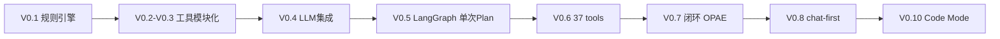

# NL-FreeCAD-Agent Architecture Evolution

本文档记录了 NL-FreeCAD-Agent 项目的架构演进历程。

## Version History

### V0.1 - Basic Framework
- 搭建双进程架构 (FastAPI + FreeCAD 插件)
- 实现规则引擎生成 Plan
- 参数提取 (正则表达式)

[详细文档](./v01-architecture.md)

### V0.2-V0.3 - End-to-End Flow
- executor.py 重构为调度器
- 引入 TOOL_REGISTRY 注册表
- 工具模块化 (cad_tools/)

[详细文档](./v02-v03-architecture.md)

### V0.4 - LLM Integration
- 集成 OpenAI-compatible API
- 系统提示词工程
- Planner 优先 LLM + 规则回退

[详细文档](./v04-architecture.md)

### V0.5 - LangGraph Workflow
- LangGraph 工作流编排（**1 个 graph**）
- 流程：parse → plan → validate → retry(≤2)
- `POST /agent/plan` 一次性返回完整 Plan

[详细文档](./v05-architecture.md)

### V0.6 - Tool Expansion
- 工具 6 → 37 个（boolean / feature / sketch / partdesign 等）
- tool_registry 树状分类检索
- executor name_map 对象名追踪
- **架构形态不变**，仍是 Plan-as-Script

[详细文档](./v06-architecture.md)

### V0.7 - Closed-Loop Agent（已归档主路径）
- **Observe-Plan-Act-Evaluate** 闭环
- LangGraph 扩展为 **3 个新 graph** + 保留旧 graph
- 三个新 API：start_plan / next_step / evaluate_step
- FreeCAD 驱动循环，Agent 无状态
- panel 切换 agent_runner（QThread + 主线程执行）

[详细文档](./v07-architecture.md)

### V0.10 - Code Mode（当前主路径）
- 主入口仍为 `POST /agent/chat`，但建模动作为 `execute_cad_program`
- 受限 Python（`cad.*`）+ AST 沙箱 + 客户端单事务
- 53 工具退到执行器内部；圆周均布走 `polar_pattern`
- 可选多视图 VLM；**尚无** bbox/贴合几何门禁

[详细文档](../code_mode.md)

---

## Architecture Evolution Overview

## V0.5 → V0.7 关键变化速查

| 维度 | V0.5 | V0.7 |
|------|------|------|
| LangGraph 数量 | 1（plan 生成） | 4（+ start / next / evaluate，旧 plan 保留） |
| Agent 参与次数 | 1 次 | 每步 2 次（next_step + evaluate_step） |
| Plan 粒度 | 完整 tool 步骤列表 | 高层 Phase + 逐步 tool_calls |
| 文档状态 | 请求时读一次 | 每轮闭环重新 observe |
| 执行控制 | panel 直接调 executor | agent_runner 闭环调度 |
| Session | 无 | FreeCAD 端维护 history / name_map |
| 失败处理 | break | repair / skip / 阶段推进 |

## Key Design Decisions

### 1. 双进程架构
- **原因**: FreeCAD 插件需要与外部 LLM 服务通信
- **方案**: FastAPI 作为 Agent 中间层
- **优势**: 解耦、易扩展、易测试

### 2. 工具注册表
- **原因**: 需要动态管理和扩展工具
- **方案**: TOOL_REGISTRY 字典 + tool_specs 规格
- **优势**: FreeCAD 执行与服务端校验共用同一套工具名

### 3. LLM 优先 + 规则回退
- **原因**: LLM 可能失败或超时
- **方案**: 优先调用 LLM，失败时使用规则引擎
- **优势**: 保证可用性

### 4. LangGraph 工作流
- **V0.5**: 管 Plan 生成与校验
- **V0.7**: 拆分为规划（start/next）与决策（evaluate）三条独立 pipeline
- **优势**: 每步 prompt 更聚焦、可独立调试

### 5. FreeCAD 驱动闭环（V0.7）
- **原因**: CAD 执行必须在 FreeCAD 进程内，且每步需最新几何状态
- **方案**: Session 存 FreeCAD 端；Agent 无状态；HTTP 往返驱动循环
- **优势**: 执行安全（主线程事务）、状态真实（非猜测）
