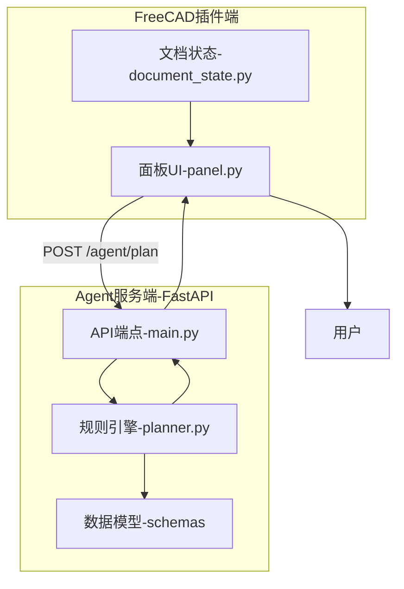
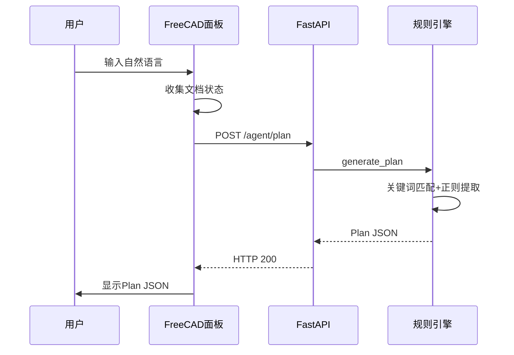

# V0.1 Architecture - Basic Framework

## System Architecture Diagram

## Workflow

**注意**: V0.1 仅生成 Plan，不执行建模操作。

## Communication Design

- **协议**: HTTP/REST + JSON
- **服务地址**: http://127.0.0.1:8765

## Core Components

| 文件 | 职责 |
|------|------|
| app/main.py | FastAPI入口，直接调用generate_plan() |
| app/llm/planner.py | 规则引擎，关键词匹配+正则参数提取 |
| app/schemas/ | Pydantic数据模型 |
| freecad_addon/panel.py | 面板UI |

## Key Changes

- 搭建双进程架构（FastAPI + FreeCAD插件）
- 实现规则引擎生成Plan
- 参数提取（正则表达式）
- Pydantic数据验证

## Next Version

[V0.2-V0.3 端到端流程打通](./v02-v03-architecture.md)
