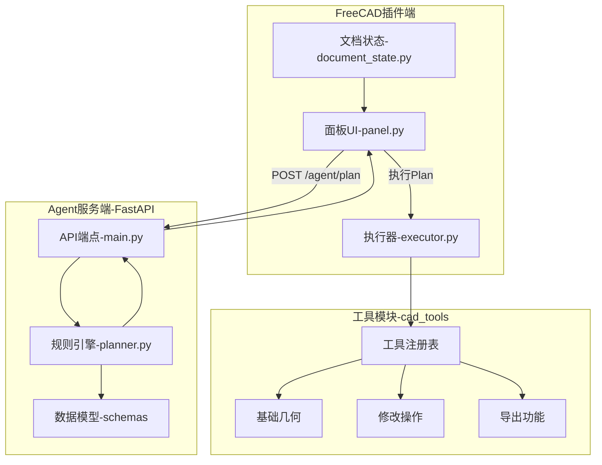
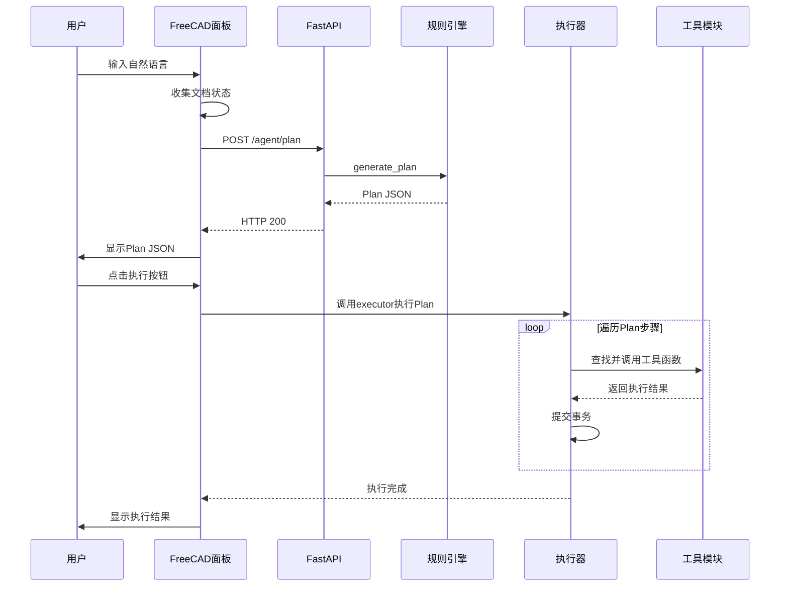

# V0.2-V0.3 Architecture - End-to-End Flow

## System Architecture Diagram

## Workflow

## Communication Design

### API 通信
- **协议**: HTTP/REST + JSON
- **服务地址**: http://127.0.0.1:8765

### 工具注册表
TOOL_REGISTRY: create_box, create_cylinder, modify_param, delete_object, save_fcstd

## Core Components

| 模块 | 文件 | 职责 |
|------|------|------|
| 插件端 | panel.py | 面板UI + 执行按钮 |
| 插件端 | executor.py | Plan执行 + 事务管理 |
| 工具模块 | cad_tools/ | 工具注册表 + 工具实现 |

## Key Changes

### V0.2: 执行器重构
- executor.py 从单体拆分为调度器
- 引入 TOOL_REGISTRY 注册表机制

### V0.3: 工具模块化
- 创建 cad_tools/ 目录结构
- panel.py 添加执行按钮

## Next Version

[V0.4 LLM集成](./v04-architecture.md)
