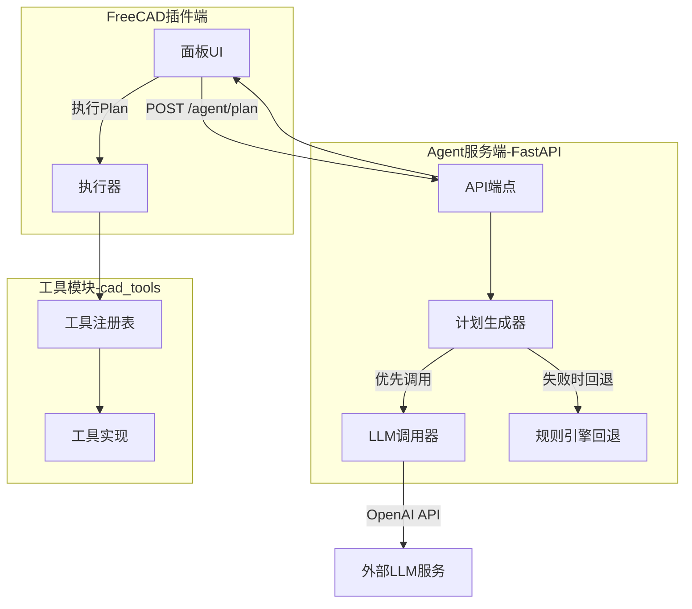
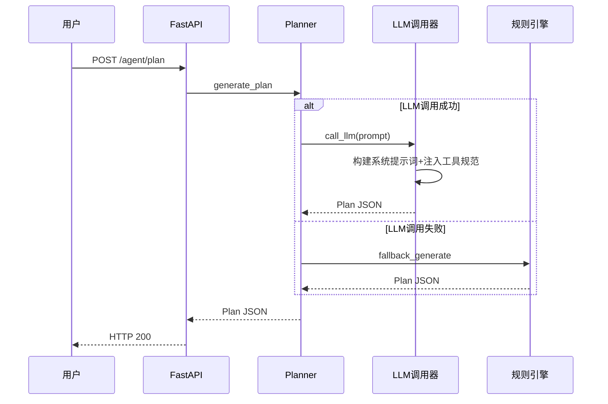

# V0.4 Architecture - LLM Integration

## System Architecture Diagram

## Workflow

## Core Components

| 模块 | 文件 | 职责 |
|------|------|------|
| LLM调用 | llm_provider.py | OpenAI API封装 |
| 计划生成 | planner.py | LLM优先+规则回退 |
| 提示词 | prompts/system_prompt.md | 系统提示词模板 |

## Key Changes

- llm_provider.py: 封装OpenAI API调用
- planner.py: 改为LLM优先+规则回退
- 系统提示词工程: 注入工具规范
- JSON模式输出: 强制结构化返回

## Next Version

[V0.5 LangGraph工作流](./v05-architecture.md)
