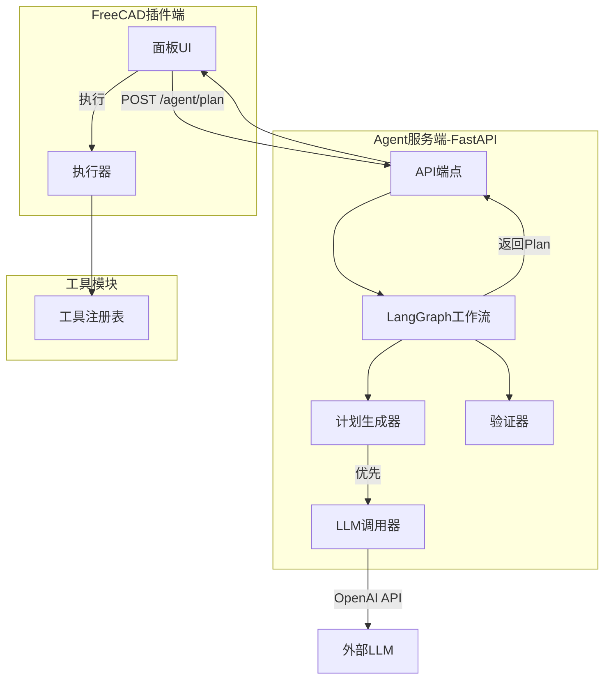
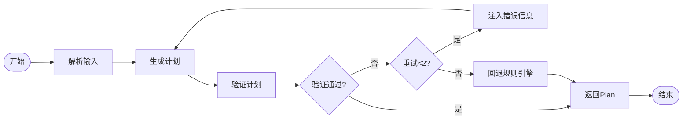
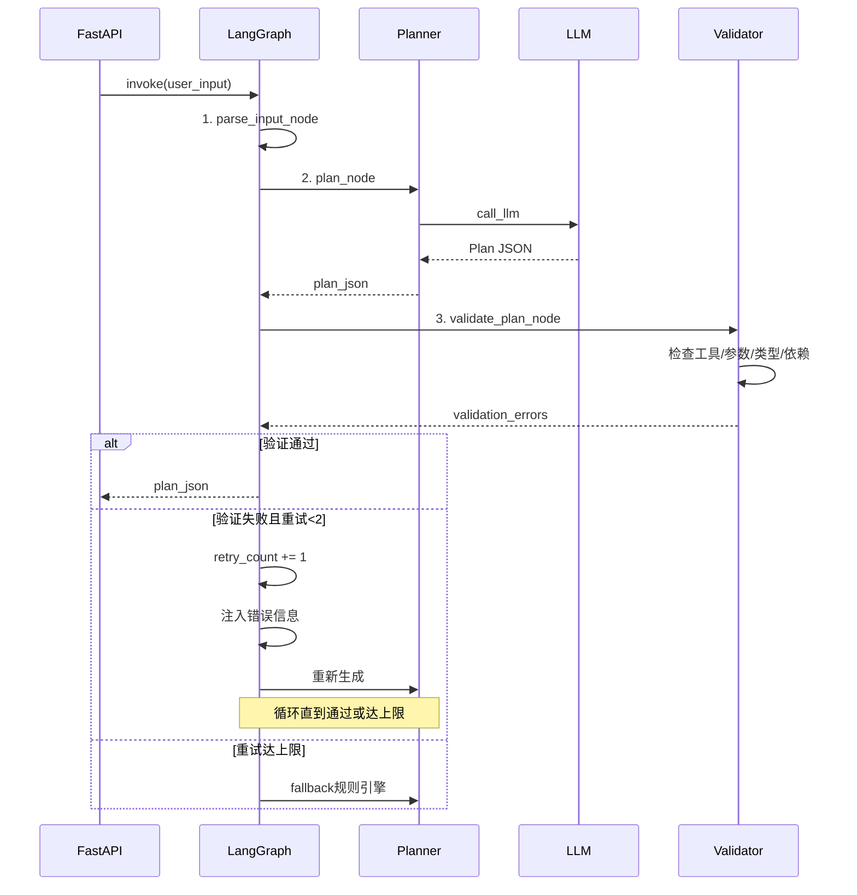

# V0.5 Architecture - LangGraph Workflow

## System Architecture Diagram

## LangGraph Workflow

## Workflow Details

## Core Components

| 模块 | 文件 | 职责 |
|------|------|------|
| 工作流 | cad_graph.py | LangGraph图定义 |
| 节点 | nodes.py | parse/plan/validate |
| 验证器 | validators.py | Plan结构验证 |

## Key Changes

- cad_graph.py: 定义工作流图
- 自动重试机制 (最多2次)
- 错误信息注入 (帮助LLM修正)
- validators.py: Plan验证逻辑

## Next Version

[V0.6 工具扩充](./v06-architecture.md) → [V0.7 闭环 Agent](./v07-architecture.md)
