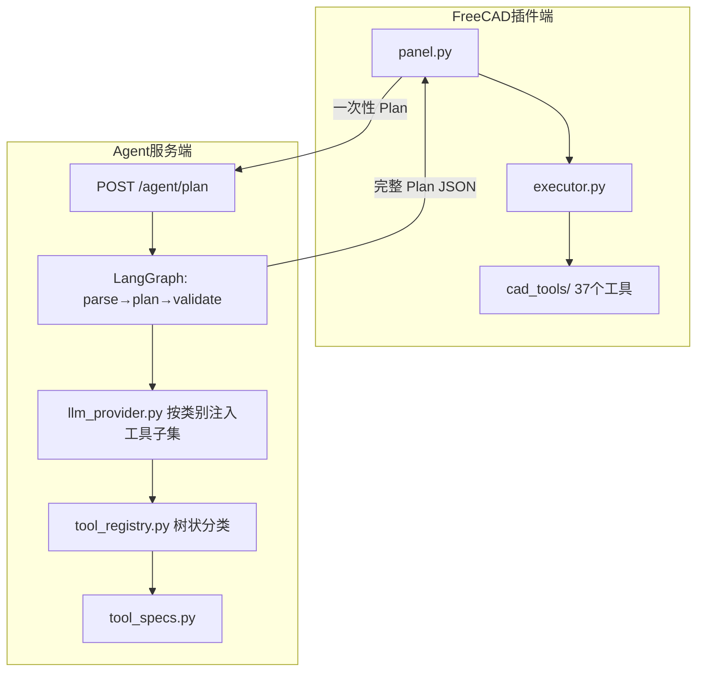
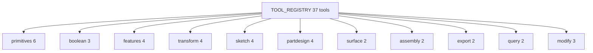

# V0.6 Architecture - 工具扩充 + 树状分类检索

## 概述

V0.6 在 V0.5 的 LangGraph 单次 Plan 流程**不变**的前提下，大幅扩展了 CAD 工具能力与服务端的工具检索机制。架构形态仍是「一次性生成完整 Plan → 盲执行」，变化集中在**工具层**。

## System Architecture Diagram

## 工具分层

## 核心改动

| 区域 | 文件 | 变化 |
|------|------|------|
| FreeCAD 工具 | `cad_tools/*.py` | 6 → 37 个工具；新增 boolean/feature/transform/sketch 等 |
| 工具规格 | `tool_specs.py` | 与 FreeCAD 侧一一对应 |
| 分类检索 | `tool_registry.py` | 树状分类，LLM prompt 可按任务注入子集 |
| 执行器增强 | `executor.py` | `name_map` 追踪对象重命名链（Base→Base_Fillet） |
| 几何辅助 | `_helpers.py` | `assign_shape_result`、拓扑选择器、`list_topology` |

## 仍存在的局限（推动 V0.7）

- Plan 仍一次性生成，执行中不感知文档变化
- 文档状态仍较粗糙（V0.7 前）
- 失败后只能 break，无法逐步修复

## Previous / Next Version

- [V0.5 LangGraph 工作流](./v05-architecture.md)
- [V0.7 闭环建模 Agent](./v07-architecture.md)
