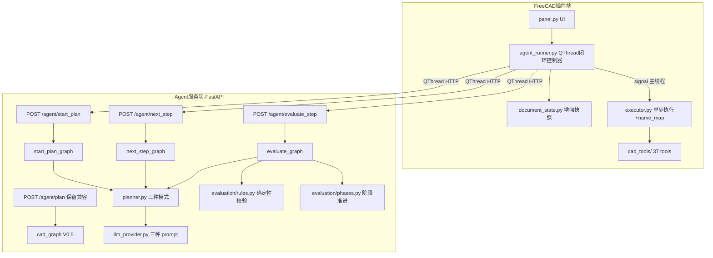
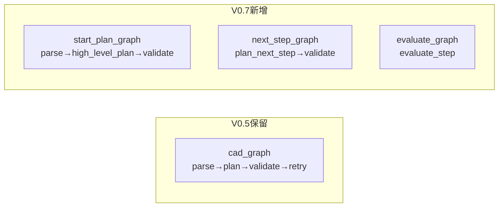
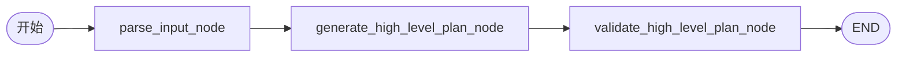
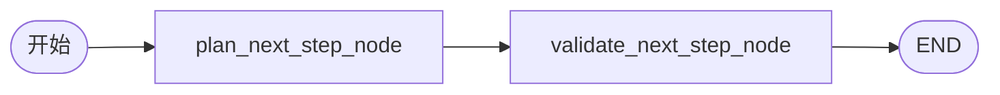
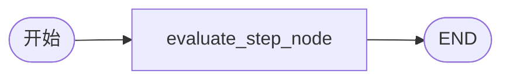
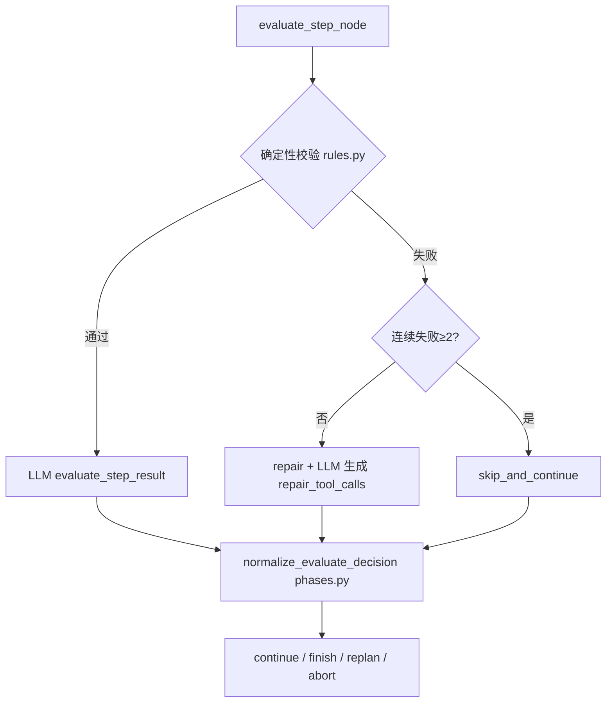
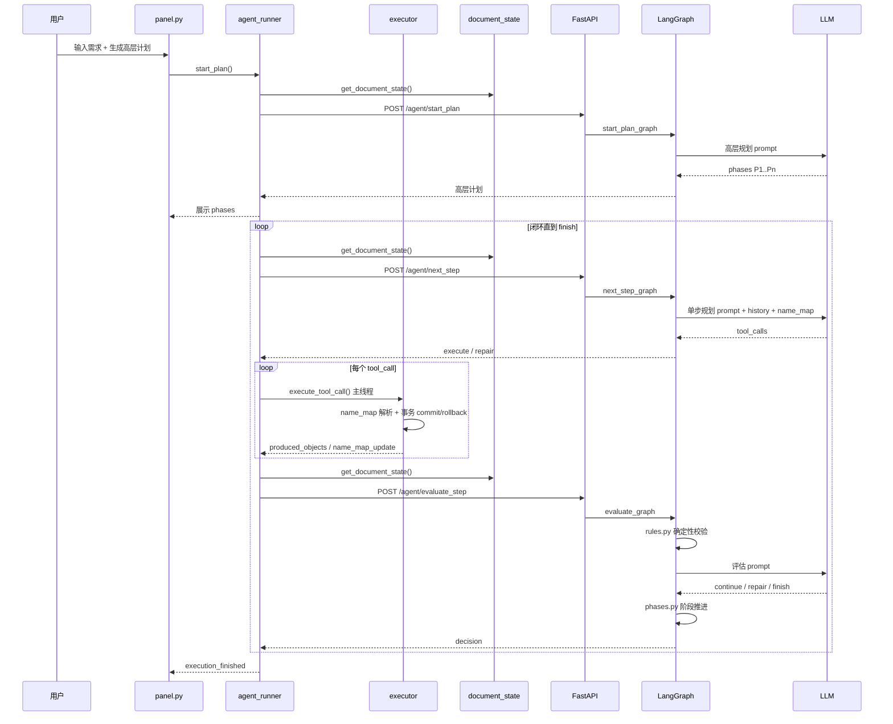
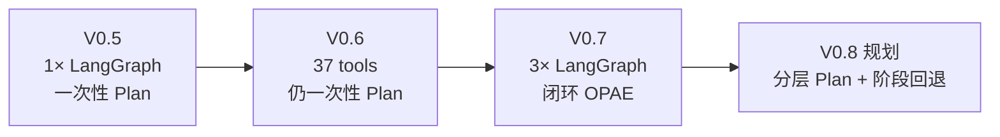

# V0.7 Architecture - 闭环建模 Agent (Observe-Plan-Act-Evaluate)

## 核心理念

从 **Plan-as-Script（一次性脚本）** 升级为 **Observe-Plan-Act-Evaluate 闭环**：

| 角色 | 职责 |
|------|------|
| **FreeCAD 插件** | Observe（读文档状态）+ Act（执行工具、事务管理） |
| **Agent Service** | Plan（高层/单步规划）+ Decide（评估、阶段推进、修复决策） |

> Session 状态（history、name_map、current_phase）保存在 **FreeCAD 端**；Agent 无状态，每次请求携带摘要。

---

## 与 V0.5 的对比

### V0.5 流程（你记忆中的版本）

```
用户输入
  → POST /agent/plan
  → LangGraph: parse_input → plan_node → validate_plan → (重试≤2) → END
  → 返回完整 Plan JSON（全部步骤）
  → FreeCAD executor 逐条盲执行
  → 完成 / 某步失败则 break
```

**特点**：Agent 只参与**一次**规划；LangGraph 管的是「Plan 生成 + 校验」；执行完全在 FreeCAD 本地。

### V0.7 流程（当前）

```
用户输入
  → POST /agent/start_plan
  → LangGraph(start_plan): parse_input → generate_high_level_plan → validate → END
  → 返回 Phase 级高层计划（P1/P2/P3…，不含具体工具参数）

用户确认 → 单步 / 自动执行，进入闭环：

  ┌─ FreeCAD: 读取 document_state + history + name_map
  │
  ├─ POST /agent/next_step
  │    → LangGraph(next_step): plan_next_step → validate_next_step → END
  │    → 返回 1~3 个 tool_calls
  │
  ├─ FreeCAD: executor.execute_tool_call() × N（主线程，带事务）
  │
  ├─ POST /agent/evaluate_step
  │    → LangGraph(evaluate): evaluate_step → END
  │    → 确定性校验 + LLM 评估 → continue / repair / skip / finish
  │
  └─ 循环直到 finish 或 abort
```

**特点**：Agent 参与**每一步**；LangGraph 拆成 **3 个独立 graph**；FreeCAD 驱动循环；每步都携带最新文档状态。

---

## System Architecture Diagram



---

## 三个 LangGraph 工作流

V0.5 只有 **1 个 graph**（plan 生成）。V0.7 扩展为 **4 个 graph**（含旧版保留）：



### 1. start_plan_graph



**输出**：`goal` + `phases[]`（phase_id / intent / success_criteria），**不绑定**具体 tool/args。

### 2. next_step_graph



**输入**：当前 phase、document_state、execution_history、name_map  
**输出**：decision + 1~3 个 tool_calls（含 call_id / args / expected_effect）

### 3. evaluate_graph



**内部逻辑**：



**phases.py** 防止非末阶段过早 `finish`，自动推进 P1→P2→…。

---

## 闭环时序图



---

## 关键机制

### 1. 双层规划

| 层级 | 生成时机 | 粒度 | 示例 |
|------|----------|------|------|
| **高层计划** | start_plan 一次 | Phase 级 intent | P1 底座 / P2 支柱 / P3 灯罩 |
| **工具调用** | next_step 每轮 | 1~3 个 tool_call | create_sketch, pad_sketch, add_fillet |

### 2. 增强文档状态 (document_state)

每轮 observe 携带：

- 对象名、类型、visible、placement
- **bbox** 包围盒
- **topology** 边/面数量、有效性
- **dependencies** 特征依赖链

### 3. name_map 对象名追踪

```
Base --fillet--> Base_Fillet --pad--> ...
TableLamp --cut_hole--> TableLamp_Hole
```

- **executor** 本地维护 name_map，`_rewrite_args()` 自动解析旧名
- **AgentSession** 同步 name_map 给 next_step 请求
- 特征工具（fillet/chamfer/cut_hole）默认生成 `{target}_Suffix` 新对象

### 4. 单步执行结果结构

```python
{
  "call_id": "P1_S1",
  "status": "success" | "error",
  "produced_objects": ["Base_Pad"],
  "source_objects": ["Base_Sketch"],
  "name_map_update": {"Base": "Base_Fillet"},
  "message": None
}
```

### 5. 失败处理策略

| 场景 | 决策 |
|------|------|
| 单步失败 | repair（LLM 生成 repair_tool_calls） |
| 连续失败 ≥2 | skip_and_continue |
| 当前 phase 完成 | continue + 推进到下一 phase |
| 所有 phase 完成 | finish |
| 无法继续 | abort |

### 6. 线程模型

- **QThread**：HTTP 请求（避免阻塞 FreeCAD UI）
- **主线程**：`execute_tool_call()`（FreeCAD API 必须在 GUI 线程）
- **QTimer.singleShot**：自动模式下步进调度

---

## API 端点一览

| 端点 | 版本 | Graph | 用途 |
|------|------|-------|------|
| `POST /agent/plan` | V0.5 | cad_graph | 一次性完整 Plan（保留兼容） |
| `POST /agent/start_plan` | V0.7 | start_plan_graph | 生成 Phase 级高层计划 |
| `POST /agent/next_step` | V0.7 | next_step_graph | 生成下一步 tool_calls |
| `POST /agent/evaluate_step` | V0.7 | evaluate_graph | 评估执行结果 + 决策 |

---

## 核心文件清单

| 文件 | 职责 |
|------|------|
| `freecad_addon/.../panel.py` | UI：生成计划 / 单步 / 自动 / 暂停 / 停止 |
| `freecad_addon/.../agent_runner.py` | 闭环控制器：Session、HTTP、signal 调度 |
| `freecad_addon/.../document_state.py` | 增强文档快照 |
| `freecad_addon/.../executor.py` | 单步执行、name_map、事务 |
| `agent_service/.../main.py` | 四个 API 路由 |
| `agent_service/.../cad_graph.py` | 四个 graph 定义 |
| `agent_service/.../nodes.py` | 全部 LangGraph 节点 |
| `agent_service/.../evaluation/rules.py` | 确定性校验 |
| `agent_service/.../evaluation/phases.py` | 阶段推进、防过早 finish |
| `agent_service/.../llm/planner.py` | generate_high_level_plan / generate_next_tool_calls / evaluate_step_result |
| `agent_service/.../schemas/session.py` | Phase、ToolCall、SessionSummary |

---

## 架构演进一览



## Previous Version

[V0.6 工具扩充](./v06-architecture.md)
