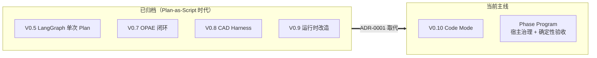

# 归档文档（历史）

> 本目录只做**历史留痕**，不是当前实现依据。
> 当前主路径见 [../development_mainline.md](../development_mainline.md) 与 [../code_mode.md](../code_mode.md)；
> 请求级走读见 [../request_walkthrough.md](../request_walkthrough.md)。

这些文档记录了被取代或被废弃的架构决策。**保留它们是为了说明"为什么走到今天"**，
阅读时请以当前文档与源码为准。

| 文档 | 记录的内容 | 归档原因 |
|------|-----------|---------|
| [architecture.md](./architecture.md) | V0.1 Plan-as-Script 双进程架构 | 被 [ADR-0001](../adr/0001-agent-plans-host-governs-phase-programs.md) 取代：模型不再生成 JSON Plan，而是写受限 Python 程序 |
| [cad_dsl.md](./cad_dsl.md) | "CAD DSL"：Plan / Tool JSON 格式 | 同上的格式层，已随 Plan-as-Script 一起废弃 |
| [api_contract_v08.md](./api_contract_v08.md) | V0.8 CAD Harness 的 API 契约 | V0.8 闭环已归档，主入口收敛为 `POST /agent/chat` |
| [runtime_flow_v08.md](./runtime_flow_v08.md) | V0.8 Harness 运行时流程 | 同上 |
| [v07_discussion.md](./v07_discussion.md) | V0.7 Observe-Plan-Act-Evaluate 升级讨论 | 历史设计讨论，结论已落地或被取代 |
| [development_plan.md](./development_plan.md) | V0.8/V0.9 query-driven 路线 | 路线已转向 Phase Program Code Mode |
| [v09_implementation_playbook.md](./v09_implementation_playbook.md) | V0.9 架构升级实施手册 | 已执行完毕 |
| [runtime_refactor.md](./runtime_refactor.md) | V0.9 运行时分步改造目录 | 同上 |
| [legacy_cleanup_feasibility.md](./legacy_cleanup_feasibility.md) | 旧闭环与冗余代码的删除可行性评估 | 清理已落地，评估本身失效 |

## 与当前主线的关系

各版本的逐版架构记录在 [../architecture/](../architecture/)（V0.1–V0.7）。
