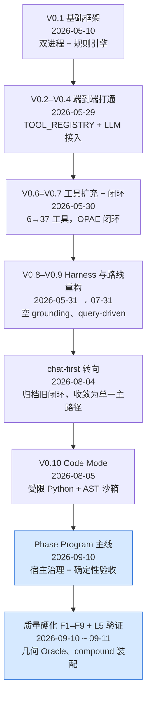

# 开发路径与里程碑

> 本文按**时间线**讲这个项目怎么一步步变成现在这样：每个阶段解决了什么、做了什么取舍、
> 留下了什么可验证的产物。逐版**架构细节**见 [architecture/](./architecture/)；被取代的方案见 [archive/](./archive/)。

---

## 一、总览



| 阶段 | 关键动作 | 关键取舍 |
|------|---------|---------|
| V0.1 | 双进程（FastAPI + FreeCAD 插件）、规则引擎生成 Plan | 先把"能跑通"钉死：LLM 不进关键路径 |
| V0.2–V0.4 | `TOOL_REGISTRY` 注册表、工具模块化、LLM 接入（规则兜底） | 工具名成为服务端与执行端的共同契约 |
| V0.6–V0.7 | 工具 6 → 37+；LangGraph 闭环 Observe-Plan-Act-Evaluate | Plan 粒度从"完整 tool 列表"升到"高层阶段 + 逐步执行" |
| V0.8–V0.9 | CAD Harness、空 grounding、query-driven 路线 | 发现"让模型逐步挑工具"成本高、易漂移 |
| chat-first | 弃用旧闭环，归档为 archive，收敛单一主路径 | **宁可删掉能跑的旧路径，也不留双轨** |
| V0.10 | 模型改写受限 `cad.*` Python 程序，AST 沙箱 + 客户端单事务 | 工具 schema 退出主上下文，模型面对的是薄 API |
| Phase Program | 宿主持有 Phase State：程序身份、单事务执行、确定性验收、State Diff | **规划权交给模型，推进权留在宿主** |

## 二、几个决定性的转折

### 1. 从"模型挑工具"到"模型写程序"（V0.7 → V0.10）

V0.7 的闭环每一步都要模型挑工具、看结果、再挑下一个，token 成本高且容易在中途漂移。
V0.10 改为让模型写一段受限 Python（`cad.box` / `cad.polar_pattern` / `cad.compound`…），
宿主负责 AST 预检、单事务执行与回滚。**模型的自由度更像"建模工程师"，而不是"工具选择器"。**

### 2. 规划权与推进权分离（Phase Program，ADR-0001）

详见 [ADR-0001](./adr/0001-agent-plans-host-governs-phase-programs.md)。核心是：
`soft_plan` 只是模型建议，**阶段能不能推进由宿主按 FreeCAD 文档事实裁决**（`passed` / `failed`）。
这直接挡住了"模型自称完成"的路径。

### 3. 质量审查：发现"门禁在验错的对象"（2026-09-10）

一次系统审查（[quality_review_action_plan.md](./quality_review_action_plan.md)，D1–D15）定位到效果差的根因不是模型弱，
而是**宿主只验「对象存在 / Shape 有效」**，而用户感知的失败是尺寸、贴合、朝向与观感。
随后按 F1–F9 逐项整改，每项都是**先写测试 → 改 → 跑 → 自审**。

其中最有价值的一次是用**几何 Oracle 抓到真 bug**：
`Shape.BoundBox` 对曲面（torus R20/r5）报 54.12，真实值是 50 —— 而验收和对齐都在用它。

### 4. 整机装配：`fuse` → `compound`（F9）

原本"整机必须 fuse 成一体"的隐含假设与三处机制互斥，实测高达会话陷入
`fuse → 删源件 → 验收失败 → 删了重建` 的死循环。
用探针实测后确认：对整机装配，`fuse` 相对 `Part.makeCompound` **零收益**，
却额外承担布尔风险、重叠要求与源件删除。于是新增 `cad.compound`（不布尔、不删源件），
并让 `export_step` / `export_stl` 支持单件 / 多件 / 整文档导出。

## 三、当前状态

### 已验证

| 层级 | 内容 | 结果 |
|------|------|------|
| L0–L1 | `agent_service` 单元/契约测试 | **246 passed** |
| L2 | 全工具冒烟（FreeCADCmd） | 114 / 0 |
| L3–L4 | 几何 Oracle（bbox / 中心 / 轴向 / 体积 / solid 数） | 19 / 0 |
| L5 | 端到端：规划 → 阶段门闩 → 装配 → 导出 | B1 `gate=passed`，5/5 阶段 |
| VLM | 三视图裁决（真实截图） | 能给出结构化 verdict / issues |

L5 对照（同一需求"创建一个人形的高达模型"，1.1 基线 vs 1.2）：

| 指标 | 1.1 基线 | 1.2 新版 |
|---|---|---|
| 终态 gate | `awaiting_execution` | **`passed`** |
| 阶段推进 | 2/5 | **6/6** |
| `cad.compound` | False | **True** |
| `cad.fuse` | 21 次 | **0 次** |

仓库内的界面截图见 [assets/](./assets/)。
阶段**总数**由模型每轮自行规划，同一提示词不同次运行会浮动；可比的是门禁行为与装配方式。

### 已知未解 / 待办

| 项 | 性质 | 说明 |
|---|------|------|
| 视觉 `warn` → 自动修码闭环 | 待 GUI 手验 | 无头只能验到"裁决"这一步（见 [agent_eval_playbook.md](./agent_eval_playbook.md) §6） |
| 阶段归属不一致 | 显示问题 | `gate=passed` 时 soft_plan 仍可能显示部分阶段 pending，会误导 GUI 用户 |
| `Shape.BoundBox` 曲面偏差 | 技术债 | 已由 `geometry_facts.exact_bbox` 在多数路径解决，但旧接口仍存在 |
| 无 CI | 工程化 | 目前靠本地 pytest + FreeCADCmd 门禁 |

完整待办见 [tech_debt.md](./tech_debt.md) 与 [agent_eval_playbook.md](./agent_eval_playbook.md)。

## 四、贯穿始终的几条经验

1. **门禁要验"用户感知的东西"。** 只验"对象存在"等于没验；几何量（bbox / 体积 / 轴向）才是判据。
2. **让模型自证完成是无效的。** 必须由宿主用文档事实裁决（ADR-0001）。
3. **效果问题要有可重复的度量。** `scripts/eval_run.py` + `scripts/session_report.py` 让 L5 从"人手点 GUI"变成可比对的指标。
4. **先看成熟做法再落地。** 装配用 `Part.makeCompound` 而非自研合并，正是"零收益就不自研"的例子。
5. **过时路径直接删。** 旧 Plan / LangGraph 闭环整体归档，不做兼容层 —— 双轨是后来所有混乱的源头。

## 五、复现

```powershell
# 环境与启动见根 README
cd agent_service ; F:\ANACONDA\python.exe -m pytest -q          # L0–L1

# L2–L4（FreeCADCmd）
& 'D:\freecad\bin\freecadcmd.exe' -c "import runpy; runpy.run_path(r'<repo>\freecad_addon\AICADAgent\tests\geometry_oracle\runner.py', run_name='__main__')"

# L5 端到端（需先启动 Agent 服务）
$env:EVAL_GOAL='创建一个人形的高达模型'
& 'D:\freecad\bin\freecadcmd.exe' -c "import runpy; runpy.run_path(r'<repo>\scripts\eval_run.py', run_name='__main__')"
```

冻结提示词、判据与基线表见 [agent_eval_playbook.md](./agent_eval_playbook.md)。
