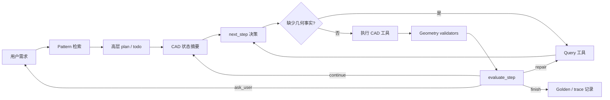

# Development Plan - NL-FreeCAD-Agent

## 0. 当前方向

本项目的目标不再是“自然语言转 FreeCAD 工具调用生成器”。

目标成品应当是一个 **CAD 版 coding agent**：它的工作方式应更接近 Cursor/Codex，而不是一次性 planner。Agent 需要理解用户需求，检索相关建模模式，读取当前 CAD 文档状态，判断自己缺少哪些几何事实，主动查询，再执行小步工具调用，然后用确定性规则校验结果，并循环推进。

核心闭环：

```text
理解用户需求
  -> 检索参考 pattern / 标准 plan 样例
  -> 生成或更新高层 todo plan
  -> 读取当前 CAD 状态摘要
  -> 判断当前步骤缺少哪些事实
  -> 调用 query 工具补充几何事实
  -> 执行 CAD 工具调用
  -> 用 deterministic validators 校验几何结果
  -> repair / continue / ask_user
  -> 再次读取当前 CAD 状态
```

关键转向：

```text
prompt-driven CAD agent
  -> retrieval/query-driven CAD agent
```

LLM 本身不是主要瓶颈。真正的瓶颈是：模型现在缺少 CAD 版 codebase indexing，也就是缺少对文档状态、拓扑、placement、测量、样例、历史 repair pattern 的干净、相关、可查询访问。

## 1. 设计原则

| 原则 | 含义 | 项目落点 |
| --- | --- | --- |
| LLM 决策，CAD API 证明 | LLM 可以推理，但几何事实必须来自 CAD 状态、查询工具、validator。 | `next_step` 做决策；query tools 和 validators 提供事实。 |
| 先检索再规划 | 整体 plan 应参考已验证 pattern，而不是纯靠模型临场发挥。 | 给 `start_plan` 接入轻量 pattern library。 |
| 先查询再执行 | placement、贴附、选面、选边、布尔、朝向相关操作前应先 query。 | query tools 进入 `TOOL_SPECS` 和 FreeCAD executor。 |
| 小步执行 | 每一步要窄到能观察、能验证、能局部修复。 | `next_step` 每次返回 1-3 个 tool calls。 |
| 用数值验收 | object exists 不等于几何合格。gap、orientation、bbox、visibility、topology 都要能验。 | geometry validators + evaluate 质量门。 |
| 局部 repair | 失败后用测量差异修正参数，而不是重启整个 plan。 | `measure_gap` / expected-vs-actual repair context。 |
| 案例是 pattern，不是标准答案 | 样例指导 plan 形状和 repair 策略，但不冻结固定 tool calls。 | 先做 `patterns/`，完整 `cases/` 放后续。 |

## 2. 目标架构



### FreeCAD 插件端

- 读取真实文档状态。
- 执行 query 和 act 工具。
- 发送 before/after state 与 execution result。
- 在面板显示 plan、当前 session id、trace path、质量门失败信息。

### Agent Service 端

- 检索 pattern。
- 生成高层 phases。
- 判断下一步应 query 还是 act。
- 运行 validators。
- 决策 continue / repair / finish / ask_user。
- 记录 trace 与 golden artifacts。

## 3. 当前版本状态

### 已完成

- V0.1-V0.3：项目骨架、FastAPI、FreeCAD workbench、基础 plan 展示、基础执行。
- V0.4：LLM structured JSON output。
- V0.5：LangGraph plan pipeline，支持校验与重试。
- V0.6：CAD 工具扩展、tool registry、拓扑工具基础。
- V0.7：闭环 `start_plan -> next_step -> execute -> evaluate_step`。
- V0.7.x 部分：debug trace、execution logging、`before_state` 基础。
- V0.8.1 部分：world bbox、placement 提取、旋转 bug 修复、document-state grounding。

### 当前阻塞项

V0.8 是可靠性地基：

- V0.8.2：geometry quality gates。
- V0.8.3：Pull query tools 和 query-before-act policy。
- V0.8.4：golden traces 和 regression checks。

在至少一个开放多体模型通过 V0.8 exit criteria 前，不进入 V0.9 大规模工具扩展。

## 4. V0.8 - 可靠的 Query-Driven CAD Agent

### 目标

建立一个可靠闭环，让 Agent 能够：

1. 用参考 pattern 生成更好的高层 plan。
2. 只读取当前任务相关的 CAD 状态。
3. 在空间操作前主动查询缺失几何事实。
4. 执行小步 CAD actions。
5. 用 deterministic validators 验收几何。
6. 用 expected-vs-actual measurement 做局部修复。

### V0.8 Exit Criteria

V0.8 只有在以下条件全部满足时才算完成：

- `golden_cases/simple_car/` 几何通过：
  - 四个轮子水平；
  - 轮子贴附/对齐车身；
  - 前灯贴附到车头面；
  - 没有明显悬空细节件。
- 至少一条 trace 能看到：
  - query tool call；
  - execution tool call；
  - validator result；
  - repair 或 continue 决策基于测量事实。
- `evaluate_step` 不能在 required validators 失败时标记成功。
- 旧 `/agent/plan` endpoint 仍可工作。
- 现有测试通过，并新增 query/validator 测试。

## 5. V0.8.2 + V0.8.3 联合实施计划

8.2 和 8.3 必须一起推进。只有 query tools 没有质量门，只是多一些 prompt 上下文；只有质量门没有 query tools，Agent 会知道失败但不知道如何智能修复。

### Step 1 - 定义 Query Tool 最小契约

新增最小 query 工具集：

| Tool | 用途 | 返回 | 使用场景 |
| --- | --- | --- | --- |
| `summarize_document` | 压缩对象树和 bbox 摘要。 | object names、types、visibility、bbox、dependency hints。 | `next_step` 上下文选择。 |
| `get_object_detail(target)` | 获取单个对象详细事实。 | placement、bbox、size、center、topology、properties、visibility。 | 贴附、对齐、repair。 |
| `measure_gap(obj_a, obj_b, axis)` | 测量两个对象在某轴的间隙/重叠。 | gap、overlap、signed_distance、touching。 | validators 和 repair。 |
| `compare_orientation(target, expected_axis)` | 检查圆柱/长轴朝向。 | actual_axis、expected_axis、passed。 | 车轮、杆件、轴。 |
| 强化 `list_topology(target)` | fillet/boolean/sketch-on-face 前查询面/边。 | face/edge id、center、normal、area/length。 | 选面、选边、拓扑校验。 |

执行改动：

- 在 `agent_service/app/tools/tool_specs.py` 增加 spec。
- 在 `freecad_addon/AICADAgent/cad_tools/query_tools.py` 实现 FreeCAD 侧工具。
- 在 `freecad_addon/AICADAgent/cad_tools/__init__.py` 注册工具。
- query result 必须可 JSON 序列化，并像普通 tool call 一样进入 execution history / trace。

校验：

- 服务端 spec/schema 单元测试。
- FreeCAD 侧每个 query tool 的 smoke test。
- debug trace 中能看到 query result。

### Step 2 - 让 Query Call 成为 `next_step` 的一等公民

`next_step` 应允许直接返回 query tool call。

规则：

- 当前 phase 涉及贴附、对齐、选面、选边、fillet、boolean、sketch-on-face、朝向敏感 placement 时，第一步通常应 query。
- query call 不应被视为 phase 完成。
- query result 应进入 `execution_history.recent`，供下一轮 `next_step` 使用。
- query history 要压缩，不无限堆叠。

实现：

- 更新 `llm_provider._build_next_step_prompt`。
- 增加“缺失事实”提示：
  - 是否缺目标对象 detail；
  - 是否缺目标 face/topology；
  - 是否缺 gap/alignment；
  - 是否缺 orientation。
- 明确告诉模型：query 工具成本低，空间猜测前优先 query。

校验：

- mock LLM 测试：placement phase 可返回 `get_object_detail`。
- 集成式测试：query result 能进入 `execution_history.recent`。

### Step 3 - 加 Server-Side Query-Before-Act Guard

仅靠 prompt 约束不够。服务端应检测“高风险动作是否缺少近期 query 证据”。

高风险操作：

- `set_placement`
- `move`
- `rotate`
- `add_fillet`
- `add_chamfer`
- `boolean_cut`
- `boolean_fuse`
- `boolean_common`
- `cut_hole`
- `create_sketch_on_face`
- `pad_to_face`
- 任何带 face/edge selector 的操作

策略：

- 如果高风险操作引用已有 target，但近期 history 没有覆盖该 target 的 query，返回 `validation_failed`。
- 初始版本使用 soft reject：让 `next_step` 重试并先 query。
- 后续可考虑自动插入 query tool call。

建议错误结构：

```json
{
  "error_code": "QUERY_REQUIRED",
  "tool": "set_placement",
  "target": "Body",
  "required_query": "get_object_detail or measure_gap",
  "reason": "Placement/attachment needs current bbox and placement facts."
}
```

实现：

- 新增 `agent_service/app/tools/query_policy.py` 或 `agent_service/app/evaluation/query_policy.py`。
- 在 `validate_next_step_node` 中调用。
- 根据 `execution_history.recent` 判断近期 query coverage。

校验：

- risky tool 无 query -> validation failed。
- risky tool 在 `get_object_detail(target)` 之后 -> allowed。
- 无 target 的 primitive creation -> allowed。

### Step 4 - Geometry Quality Gates

validators 必须和 phase 目标绑定。对象存在只是 baseline。

第一批质量门：

| Validator | 目的 |
| --- | --- |
| `verify_object_exists` | 生成对象存在。 |
| `verify_shape_valid` | shape/topology 有效。 |
| `verify_source_hidden` | boolean/feature source object 按预期隐藏。 |
| `verify_bbox_close` | bbox 接近期望范围。 |
| `verify_attachment_gap` | 对象间 gap 在阈值内。 |
| `verify_orientation` | dominant axis 或 cylinder axis 符合期望。 |
| `verify_visibility_set` | 预期可见对象可见，helper 隐藏。 |
| `verify_phase_criteria` | phase success criteria 映射到具体 checks。 |

实现：

- 扩展 `agent_service/app/evaluation/validators.py`。
- 增加 measurement helpers，供 `measure_gap` 和 validators 复用。
- 从以下来源提取 expectations：
  - `last_tool_call.expected_effect`；
  - 当前 abstract step success criteria；
  - recent query results；
  - tool call 可选 `expectations` 字段。

校验：

- before/after fixtures：
  - attached vs floating；
  - wheel horizontal vs vertical；
  - bbox mismatch；
  - helper/source visibility。
- required validator 失败时，`evaluate_step` 必须强制 `repair`，不能 `continue`。

### Step 5 - Expected-vs-Actual Repair Context

repair 不能只收到 “not found” 这类笼统错误。如果真实失败原因是 15mm gap 或朝向错误，就必须把数值差异传给 repair。

validator failure 应包含：

- expected value；
- actual value；
- signed delta；
- target object names；
- 尽可能给出 suggested query 或 correction dimension。

示例：

```json
{
  "validator": "verify_attachment_gap",
  "passed": false,
  "error_code": "ATTACHMENT_GAP_TOO_LARGE",
  "message": "Wheel_FL is 12.0mm away from Body on -Y face.",
  "expected": {"gap": 0, "axis": "Y"},
  "actual": {"gap": 12.0, "axis": "Y"},
  "repair_hint": {"tool": "move", "args": {"target": "Wheel_FL", "dy": 12.0}}
}
```

实现：

- validator result schema 增强，但保持向后兼容。
- `evaluate_step_with_llm` 的 user message 注入 validator results。
- repair 优先局部改 args，不整体 replan。

校验：

- 错误 placement 能产生 numeric repair hint。
- validator 失败时，`evaluate_step` 返回 `repair` 而不是 `continue`。

### Step 6 - 状态上下文瘦身

当前 `_build_document_context` 把很多空间规则塞进 prompt。这对调试有帮助，但不应是最终架构。

目标上下文：

- 默认：紧凑对象树 + 一行 bbox 摘要。
- 详细对象事实：通过 `get_object_detail`。
- topology：通过 `list_topology`。
- measurements：通过 `measure_gap` 和 validators。

实现：

- 保留 `_build_document_context`，但缩短默认输出。
- 增加 recent query results 的专门格式化。
- 避免重复注入冗长通用几何说明。

校验：

- debug trace 中 `next_step` prompt 更短，query result 更突出。
- 简单 primitive 创建无回归。

## 6. V0.8.4 - Pattern Retrieval 与 Golden Regression

### Step 1 - 轻量 Pattern Library

先不做完整 cases 数据库，先建立小型 pattern library：

```text
agent_service/app/patterns/
  simple_car.json
  lamp_model.json
  base_with_holes.json
  README.md
```

pattern 文件结构：

```json
{
  "pattern_id": "simple_car",
  "task_type": "multi_part_open_model",
  "keywords": ["car", "vehicle", "wheels", "lights"],
  "plan_shape": {
    "phases": [
      {
        "title": "Body",
        "intent": "Create the main vehicle body.",
        "success_criteria": ["visible body exists", "body has stable bbox"]
      }
    ]
  },
  "required_queries": [
    "get_object_detail before attaching details",
    "measure_gap before marking attachment complete"
  ],
  "validators": [
    "verify_object_exists",
    "verify_orientation",
    "verify_attachment_gap"
  ],
  "notes": [
    "Pattern guides plan shape only. Do not copy fixed coordinates blindly."
  ]
}
```

规则：

- pattern 指导 high-level plan 和 success criteria。
- pattern 不注入固定 tool calls 到 `next_step`。
- pattern 可以推荐 validators 和 query policy。

校验：

- 用户输入 “create a simple car” 时，`start_plan` 包含受 `simple_car` 指导的 phases。
- debug trace 记录 matched pattern id。

### Step 2 - `start_plan` 接入 Pattern Retrieval

实现：

- 新增 `agent_service/app/patterns/registry.py`。
- 初版使用 keyword + task_type 匹配。
- 把 matched pattern summary 注入 high-level plan prompt。
- 将 matched pattern id 写入 `high_level_plan`。

校验：

- pattern matching 单元测试。
- mock LLM 测试确认 prompt 包含 pattern summary。
- 无 pattern 命中时，`start_plan` 仍正常工作。

### Step 3 - Golden Cases

创建：

```text
golden_cases/
  simple_car/
    user_input.txt
    expected_plan_shape.json
    acceptance.md
    trace_summary.json
  lamp_model/
  base_with_holes/
```

每个 golden case 记录：

- user input；
- matched pattern；
- high-level plan；
- required query events；
- final document-state acceptance criteria；
- 必要时记录人工截图说明；
- known limitations。

校验：

- 每次 V0.8 主链路大改后至少跑 `simple_car`。
- `replay_trace.py` 校验 trace schema 和事件顺序：
  - pattern；
  - query；
  - act；
  - validator；
  - evaluate decision。

## 7. V0.9 - 可靠之后再扩能力

V0.9 必须等 V0.8 exit criteria 通过后再启动。

### V0.9.1 - 自适应 Plan 严格度

目标：

- 解析用户 detail level 和 required parts。
- 调整 phase 数、success criteria、query strictness、validators。

例子：

- “rough car” -> 更少 phases，简单 primitive，较宽松视觉标准。
- “detailed car with four wheels and headlights attached” -> 明确部件清单和更严格 validators。

校验：

- 同一 model type 不同 detail level 会产生不同严格度。
- strict mode 启用更多 validators。

### V0.9.2 - Tier A Tools: Sketch + Pad/Pocket

每个新增工具必须自带：

- query requirement；
- validator；
- golden fragment；
- trace example。

第一批：

- `create_body`
- `create_sketch`
- `create_sketch_on_face`
- `sketch_add_rect`
- `sketch_add_circle`
- `pad_sketch`
- `pocket_sketch`

校验：

- face-based sketch 必须先 `list_topology`。
- pad/pocket 结果校验 topology 和 bbox/volume delta。

### V0.9.3 - Tier B Tools: Pattern / Mirror / Shell

目标：

- 减少重复坐标猜测。
- 支持对称部件，如车轮、桌腿、孔阵列。

校验：

- 四轮模型能减少重复 placement 猜测。
- mirror/pattern 结果校验 bbox 对称性。

### V0.9.4 - Controlled Repair

目标：

- repair 局部且有上限。
- 连续 repair 失败后询问用户或安全停止。

规则：

- repair 必须引用原始 `call_id`。
- 每个 call 的 repair attempts 有上限。
- repair 必须使用 validator/query facts。

校验：

- 错误轮子 placement 能基于 measured delta 修复。
- 连续失败能干净退出并记录 trace。

## 8. V0.10 - Verified Pattern / Case Retrieval

V0.10 将 lightweight patterns 扩展为检索型 cases 系统。

目录：

```text
cases/
  v0.9/
    plan/
    execution/
    repair/
  README.md
```

case 类型：

- Plan cases：user input -> phases and success criteria。
- Execution cases：current state + current phase -> query/action pattern。
- Repair cases：validator failure -> query/repair pattern。

metadata：

- task type；
- tool version；
- validator version；
- FreeCAD version；
- pattern id；
- required query sequence。

校验：

- retrieval 改善 plan shape，但不强制 exact tool calls。
- tool-version mismatch 能过滤过期 cases。

## 9. V0.11 - Human Review and Refinement

人工 review 应放在自动闭环可靠之后。

计划能力：

- 编辑 high-level phases；
- 编辑 success criteria；
- approve risky operations；
- refine current step；
- annotate golden traces。

规则：

- human edits 必须回流到 `next_step` 和 validators。
- human review 不能用来掩盖 query/validator coverage 缺失。

## 10. 近期执行清单

### Milestone A - Query Tool Minimum Set

- [ ] 增加 `summarize_document` spec。
- [ ] 增加 `get_object_detail` spec。
- [ ] 增加 `measure_gap` spec。
- [ ] 增加 `compare_orientation` spec。
- [ ] 实现 FreeCAD query tools。
- [ ] 注册 query tools。
- [ ] 增加 query smoke tests。

### Milestone B - Query-Before-Act Guard

- [ ] 增加 query policy helper。
- [ ] 检测 risky tools。
- [ ] 检测 recent query coverage。
- [ ] 必要时返回 `QUERY_REQUIRED`。
- [ ] 增加 tests。

### Milestone C - Quality Gates

- [ ] 增加 `verify_attachment_gap`。
- [ ] 增加 `verify_orientation`。
- [ ] 增强 validator result payload。
- [ ] 将 validators 绑定到 abstract steps / pattern criteria。
- [ ] 确保 failed validator 强制 repair。
- [ ] 增加 before/after fixtures。

### Milestone D - Pattern-Guided `start_plan`

- [ ] 增加 `patterns/` 目录。
- [ ] 增加 `simple_car.json`。
- [ ] 增加 `lamp_model.json`。
- [ ] 增加 `base_with_holes.json`。
- [ ] 增加 pattern registry。
- [ ] 将 matched pattern summary 注入 high-level plan prompt。
- [ ] trace 中记录 matched pattern id。

### Milestone E - Golden Regression

- [ ] 增加 `golden_cases/simple_car/acceptance.md`。
- [ ] 捕获一条 passing trace。
- [ ] 增加 trace schema/order validation。
- [ ] 记录人工 FreeCAD 验证步骤。

## 11. 暂时不做

V0.8 exit 前暂不做：

- 不新增大规模建模工具族。
- 不建立大型 case database。
- 不引入 multi-agent 架构。
- 不把 WebSocket 作为核心依赖。
- 不把截图作为主 validator。
- 不允许 LLM success judgement 覆盖 geometry validators。
- 不把一次性坐标写进 pattern 当作通用答案。

